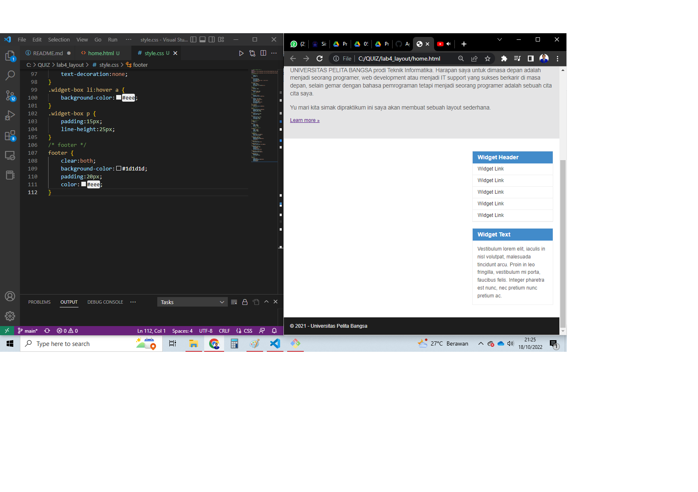

# Lab4Web

### Membuat Box Element
Kemudian tambahkan kode untuk membuat box element dengan tag `div`
### CSS Float Property
Selanjutnya tambahkan deklarasi CSS pada head untuk membuat float element.
Dan berikut adalah syntax dan gambar hasilnya :

### Mengatur Clearfix Element
Clearfix digunakan untuk mengatur element setelah float element. Property clear digunakan untuk
mengaturnya.
Tambahkan element div lainnya seteleah div3 dan atur property clear pada CSS.
Berikut syntax dan hasilnya :

# lab4_layout

### Membuat Kerangka Layout Dengan Semantics Element
Setelah membuat folder dan file html serta css yang baru, untuk step selanjutnya kita membuat rangka layout dengan semantics. Berikut adalah syntax dan hasilnya :

### Membuat Layout
Kemudian di sini kita akan menambahkan kode CSS untuk membuat layoutnya. Berikut sytanx dan hasilnya :

### Membuat Navigasi
Langkah berikut nya dalam praktikum ini adalah mengatur navigasi, dengan syntax dan hasil sebagai berikut :

### Membuat Hero Panel
Lalu selanjutnya membuat hero panel. Tambahkan kode HTML dan CSS seperti gambar berikut : 
kode pada html :

kode pada CSS : 

### Mengatur Layout Main dan Sidebar
Selanjutnya mengatur main content dan sidebar, tambahkan CSS float. Dengan menambahkan kode dan hasilnya seperti gambar berikut

### Membuat Sidebar Widget
Langkat selanjutnya adalah menambahkan element lain dalam sidebar pada file html dan menambahkan juga kode pada CSS.
Kode dan hasilnya ada pada gambar berikut :
Pada HTML :

Pada css :

### Mengatur Footer
Berikutnya dengan menambahkan kode pada CSS untuk footer kita akan mengatur tampilan footer.
contoh kode dan gambar nya sebagai berikut :

### Menambahkan Elemen lainnya pada Main Content
Lalu disini kita akan menambahkan elemen-elemen lainya pada praktikum membuat layout sederhana ini. Berikut kode ditambahkan pada file html dan css dan berikut contoh hasilnya :
Tampilan pada HTML :

Tampilan pada CSS :

### Menambahkan Content Artikel
Selanjutnya membuat content artikel. Tambahkan HTML berikut pada main content. Dan tambahkan kode juga pada CSS :
berikut contoh hasilnya :
Tampilan pada HTML :

Tampilan pada CSS :

